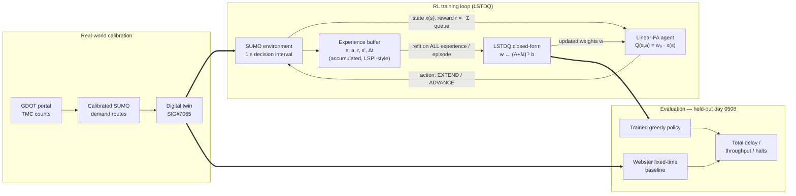

# Traffic Signal Control — SIG#7065 — Presentation Outline
Format per slide: (1) on-slide bullets — short, for the screen: (2) speaker
script — full sentences, ~1 minute (~140–160 words) when read aloud.

---

## SLIDE 1 — Related Work: How Linear FA + LSTDQ Works

**Title:** Linear Function Approximation (FA) with Least Squares Temporal
Difference (LSTDQ) shown adequate for optimal Q-function control
(Sahachaiseree et al., 2025)

**On-slide formula:**
```
Q(s, a) = w_aᵀ · x(s)      (linear FA — Q is a weighted sum of state features)
```

**Bullets:**
⚫ Q-function = a plain weighted sum of state features, no neural network
⚫ LSTDQ builds two matrices from a batch of transitions, solves one linear
  system for the weights
⚫ Closed-form — no gradient steps, policy improvement folded into the solve

**Script (~1 min):**
This work is inspired by Sahachaiseree and Oguchi, 2025, who pair a linear
function approximator with LSTDQ — least squares temporal difference for
Q-learning. The Q-function here is deliberately simple: Q of state and
action is just a weight vector for that action, dotted with a feature vector
describing the state — a plain weighted sum, no neural network, no hidden
layers. LSTDQ is how you solve for those weights. Instead of nudging them
step by step like gradient descent, it takes a whole batch of observed
state-action transitions, builds two matrices from them — one capturing how
features transition into one another, one capturing the rewards — and then
solves a single linear system to get the weights directly, in one shot.
There's no learning rate anywhere in that process, and policy improvement —
picking the best action — is folded into the same solve. So the entire
learned controller is just that one weight vector. The next slide is why
that simplicity is worth having.

---

## SLIDE 2 — Related Work: Why It's Worth Using

**Title:** Linear FA + LSTDQ — interpretable, stable, and effective at low
saturation (Sahachaiseree et al., 2025)

**Bullets:**
⚫ Pros: few parameters → interpretable weights; closed-form → stable, no
  learning rate to tune
⚫ Reported: cuts ~half of pretimed delay at low intensity
⚫ Limitation: gain fades as saturation rises; oversaturation never tested

**Script (~1 min):**
So why use such a simple model? Three reasons, all reported in the paper.
First, interpretability: because the Q-function has so few parameters — 32
in their example, versus hundreds or thousands for a neural network — every
single weight is directly readable. You can point at a number and say "this
is how much a queue on that lane pushes the controller toward holding the
green." Second, stability: the closed-form solve converges more reliably
than gradient descent, with no learning rate to tune and no risk of it
oscillating or diverging. Third, it actually works — on their low-intensity
traffic scenario, it cuts roughly half the average delay of pretimed,
fixed-time control. But here's their own reported limitation, and it's the
one that motivates this whole project: that advantage shrinks as demand
intensity rises, and they never test genuinely oversaturated conditions.
That gap — high saturation — is exactly what we set out to address.

---

## SLIDE 3 — Proposed Approach

**Bullets:**
⚫ Build an LSTDQ-for-linear-FA controller on a real intersection, inspired
  by the paper
⚫ Then extend: add state features targeting high saturation
⚫ Learner/action space held fixed — isolate what the new features contribute

**Script (~1 min):**
Given that gap, our approach has two stages. First, we build our own
LSTDQ-for-linear-FA signal controller, inspired by the paper's method but
targeting a real intersection — Peachtree and Piedmont in Atlanta — with real
calibrated traffic data, rather than their symmetric toy network with Poisson
arrivals. That matters, because a real intersection has asymmetric
approaches, real lane geometry, and demand that actually reaches saturation,
which their toy network never did. Second, extend: once that base controller
is working and validated, we add new state features specifically designed to
help it under high-saturation, spillback conditions — without changing the
underlying function approximator or learning rule. So the extension is
isolated to "what does the agent observe," not "how does it learn." That
separation matters for being able to say clearly what caused any improvement,
or failure, we see later on.

---

## SLIDE 4 — The Model

```
Q(s, a) = w_a · x(s)
```

**Bullets:**
⚫ One weight vector per action, no hidden layers
⚫ Policy = greedy — pick the higher of Q(s, EXTEND) / Q(s, ADVANCE)
⚫ Entire model = one matrix (`LinearQ`)

**Script (~1 min):**
So what does this model actually look like on our intersection? Q of state
and action equals a weight vector for that action, dotted with a feature
vector describing the state — that's it, no hidden layers, no activation
functions. In our case there are only two actions: extend the current
signal phase, or advance to the next one in the cycle. At every decision
point, the agent computes both Q-values from the same feature vector and
just picks whichever is larger — that's the entire policy, a greedy argmax
over two numbers. The whole model is implemented as one matrix — an
actions-by-features array — and a matrix-vector multiply. There's no
training loop in the neural-network sense; the model is exactly as many
numbers as you can print on a page, which is the interpretability the
previous slide promised.

---

## SLIDE 5 — Least-Squares Temporal Difference for Q-Learning

```
A = Σ x(s,a) · [x(s,a) − γ·x(s', a*)]ᵀ      a* = argmax_a Q(s', a)
b = Σ x(s,a) · r
w ← (A + ridge·I)⁻¹ · b
```

**Bullets:**
⚫ Closed-form solve — no gradient steps
⚫ Policy improvement happens inside the solve (Bellman-optimality form)
⚫ Two real-world deviations: ridge term (conditioning), semi-MDP
  discounting (unequal decision lengths)

**Script (~1 min):**
To get those weights, we use LSTDQ — least squares temporal difference for
Q-learning. Given a batch of transitions, we build two objects: a matrix A
and a vector b, both accumulated from outer products of the feature
vectors, and then solve one linear system to get the weights directly — no
gradient steps. This is the Bellman-optimality variant, meaning policy
improvement — the argmax over next-state actions — happens inside that same
solve, so there's no separate actor-critic loop. We did have to deviate from
the paper in two ways, both because we're on a real system, not their toy
one. First, we add a ridge regularization term, because our forty-plus
correlated real lane features leave that matrix singular without it.
Second, we discount by gamma to the power of duration, not a flat gamma,
because our decisions take unequal real time — a one-second extension
versus a ten-second phase change with clearance.

---

## SLIDE 6 — Pipeline: Data → Twin → Environment → Learner → Policy

**Diagram (Mermaid — verified against the implementation):**


**Bullets:**
⚫ Real GDOT data → calibrated demand → digital twin
⚫ Each decision: observe → act → simulate → log reward
⚫ Refit on all accumulated experience each episode; checkpointed for resume

**Script (~1 min):**
Putting it all together — here's the full pipeline, end to end. We start
from GDOT's own turning-movement-count portal export, turn it into
calibrated SUMO demand, and run it against our digitized digital twin of the
real intersection. At every one-second decision point, the environment
reads per-lane occupancy, builds the feature vector, lets the agent pick
extend or advance, steps the simulation forward, and logs the reward and how
long that decision took. Those transitions accumulate across an entire
episode — one simulated day — and get appended to everything collected so
far. We then re-solve LSTDQ on all of that accumulated experience, not just
the latest episode, because refitting on a single episode alone causes the
weights to oscillate. Every episode is checkpointed, so a run can be
interrupted and resumed exactly. At the end, we evaluate the greedy policy
against Webster fixed-time on the same network.

---

## SLIDE 7 — State Features: The Extension, in 3 Steps

| Version | Features | What changed |
|---|---|---|
| **Flat** | phase one-hot + 32 raw lane counts, shared across phases | initial baseline |
| **Phase-gated** | same counts, separate weight block per active phase | fixes a real bug |
| **PG-elapsed** | phase-gated + normalized occupancy + elapsed-time | our extension |

**Bullets:**
⚫ Flat → shared lane weights → degenerate, gridlocks every scale
⚫ Phase-gated → separate weights per phase → fixes the gridlock
⚫ PG-elapsed → + occupancy + elapsed-time → our high-saturation extension

**Script (~1 min):**
The one piece of this architecture that actually changed during the project
is the state feature layout, and it's worth walking through as its own
short story. We started with a flat feature vector — a phase one-hot plus
thirty-two raw lane counts, with the same lane weights reused no matter
which phase was active. That turned out to be a real bug: it can't
represent "extend while my active lanes are busy," so the agent
degenerately parked on the busiest phase and gridlocked the intersection at
every demand level we tested. The fix was phase-gating — giving each active
phase its own block of lane weights, so the phase-lane interaction becomes
representable. That alone fixed the gridlock. Our actual extension builds
on top of that: normalizing counts to occupancy, and adding a phase-gated
elapsed-time-in-phase feature — a spillback and commitment signal the
original paper's state never had, and the one to two new features our
proposal targeted.

---

## SLIDE 8 — Experiment Setup

**Bullets:**
⚫ Held-out day 0508 (never trained on); trained on 0505/0506/0507
⚫ Metric: total delay = in-network delay + insertion backlog (spillback)
⚫ Baseline: Webster fixed-time, same twin/cycle
⚫ Compare PG-raw / PG-norm / PG-elapsed (multi-seed, n=5)

**Script (~1 min):**
Now the experiments. Everything below is evaluated on day 0508 — a full
calibrated day of real GDOT data that's held out entirely from training,
which only ever sees 0505, 0506, and 0507. Our metric is total delay:
in-network delay plus insertion backlog, because under heavy saturation a
controller can look artificially good by simply holding cars outside the
network rather than actually serving them — that backlog has to be
counted, or the number lies. The baseline throughout is Webster fixed-time,
running on the identical network and four-phase cycle. We compare three
feature variants that only differ in state representation: PG-raw, the
phase-gated raw counts; PG-norm, the same thing normalized to occupancy;
and PG-elapsed, our extended state with the added elapsed-time feature —
and that one has actually been run across five random seeds, not just one,
which matters for what's coming next.

---

## SLIDE 9 — Results: Peak-Window Total Delay (s), Held-Out Day 0508

| scale | v/c | PG-raw | PG-norm | **PG-elapsed (median, n=5)** | Fixed-time |
|---|---|---|---|---|---|
| 1.0× | 0.92 | 1,291 | 1,119 | **489** [185–786] | 230 |
| 1.3× | 1.20 | 3,709 | 2,747 | **1,855** [1,403–8,910] | 912 |
| 1.8× | 1.66 | 10,388 | 9,355 | **5,899** [3,042–7,149] | 4,878 |

**Bullets:**
⚫ PG-elapsed = best median RL variant at every scale shown
⚫ But ~40% of seeds "park" a phase → wide spread (1.3× up to 8,910s)
⚫ Still worse than fixed-time at these saturated scales

**Script (~1 min):**
Here's the headline number: peak-window total delay in seconds, at three
saturated scales. Across the board, PG-elapsed — our extended feature set —
has the best median delay of the three RL variants, beating both the raw
and the normalized versions. That's a real, meaningful improvement from the
added features. But look at the range: at 1.3 times demand, the five seeds
span from 1,400 seconds all the way to 8,900. That's because two of the
five seeds collapse into a bad policy — the agent parks on a low-demand
phase and lets the busy approach jam solid. So the improvement is real on
the median, but it's not yet reliable. And even in the best case, none of
these three variants actually beats fixed-time yet at these saturated
scales — PG-elapsed narrows the gap the most, but the gap is still there.

---

## SLIDE 10 — Is That Gap Real? (Bootstrap CI, PG-elapsed vs. Fixed-Time)

| scale | PG-elapsed − fixed (median) [95% CI] | verdict |
|---|---|---|
| 1.0× | +259 s [−45, +556] | not distinguishable |
| 1.3× | +943 s [+491, +7,998] | **worse** (CI excludes 0) |
| 1.8× | +1,021 s [−1,836, +2,271] | not distinguishable |

**Bullets:**
⚫ Only firm claim at n=5: worse at 1.3×; undetermined at 1.0×/1.8×
⚫ Parking-collapse rate: 40% [12–77%] CI
⚫ n=20 retrain running now, for narrower, comparable CIs

**Script (~1 min):**
So is that gap statistically real, or just noise from five seeds? We
bootstrapped a 95% confidence interval on the difference between PG-elapsed
and fixed-time at each scale. At 1.3 times demand, the interval is entirely
positive — PG-elapsed is genuinely worse there, not just unlucky. But at
1.0 and 1.8 times, the interval straddles zero, so we honestly cannot say
better or worse yet — that's not a null result, it's an underpowered one.
The parking-collapse rate itself is 40%, but with a confidence interval as
wide as 12 to 77%, since n equals 5. The honest, defensible headline right
now is: worse at 1.3x, undetermined elsewhere. And this is exactly why,
right now, in the background, we're retraining all three variants out to
twenty seeds each — to get intervals narrow enough to actually compare all
three variants fairly, which is the next result to report.

---

*(Next: progress-update framing that ties architecture → experiments →
where this leaves the project, when you're ready.)*
